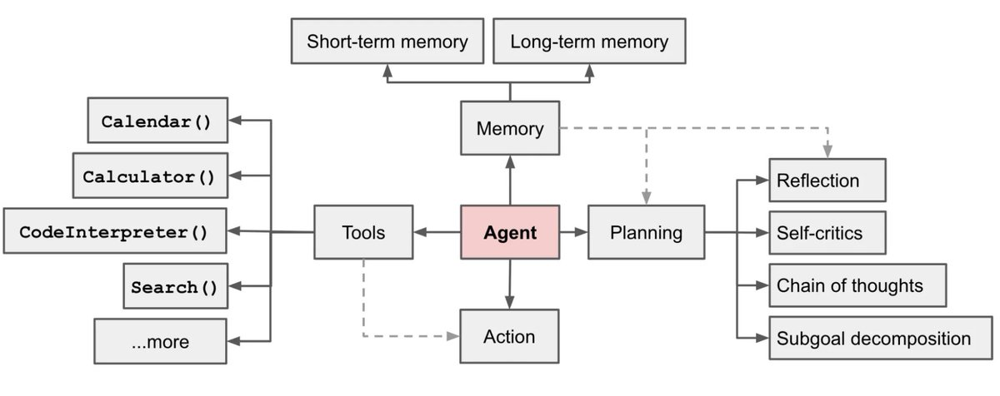

# 构建应用
> We believe that the most powerful and differentiated applications will not only call out to a language model via an API, but will also:
> 1. Be data-aware: connect a language model to other sources of data
> 2. Be agentic: allow a language model to interact with its environment  
> 
> 我们相信，最强大和差异化的应用程序不仅会通过 API 调用语言模型，而且还会：
> 1. 数据感知：将语言模型连接到其他数据源
> 2. 代理：允许语言模型与其环境交互

三种类型的应用
1. 单步。输入 + LLM => 输出。 Dify
2. 多步：手动编排流程(Chain/Flow)。输入 => [输入 + 服务 => 输出] * n => 输出。
3. 单步：自动编排流程(Agents)。输入 => [agents 自动编排流程] => 输出。AutoGPT，Generative Agent、GPT-Engineer、BabyAGI。

## Agents
> Agent System 是什么
> 在以 LLM 为驱动的 AI Agents 系统中，LLM 是代理系统的“大脑”，并需要其他几个关键组件的辅助：
> 1. 规划（Planning）• 子目标和分解：AI Agents 能够将大型任务分解为较小的、可管理的子目标，以便高效的处理复杂任务；• 反思和细化：Agents 可以对过去的行为进行自我批评和反省，从错误中吸取经验教训，并为接下来的行动进行分析、总结和提炼，这种反思和细化可以帮助 Agents 提高自身的智能和适应性，从而提高最终结果的质量。
> 2. 记忆 （Memory）• 短期记忆：所有上下文学习都是依赖模型的短期记忆能力进行的；• 长期记忆：这种设计使得 AI Agents 能够长期保存和调用无限信息的能力，一般通过外部载体存储和快速检索来实现。
> 3. 工具使用（Tool use）• AI Agents 可以学习如何调用外部 API，以获取模型权重中缺少的额外信息，这些信息通常在预训练后很难更改，包括当前信息、代码执行能力、对专有信息源的访问等。

## LLM
* 选择模型
* 模型参数
* 微调。 模型适应任务。
* Prompt。 任务适应模型。
* Embedding。

## 聊天类
* [Chatbase](https://www.chatbase.co/) Custom ChatGPT for your data.

## 聊天类 GUI
* [ChatFiles](https://github.com/guangzhengli/ChatFiles) 基于 GPT 的 Embedding。用各种开源的组件搭的：  LangchainJS, Chatbot-ui 等 。ts 写的。
* [川虎 Chat](https://github.com/GaiZhenbiao/ChuanhuChatGPT) 为ChatGPT等多种LLM提供了一个轻快好用的Web图形界面和众多附加功能。
  * [( NSFW测试版 ) 川虎 ChatGPT ](https://github.com/bigemon/ChuanhuChatGPT) 这个实验性的Repo增加了「前置引导」和「后置诱导」功能。为部分包含敏感场景的文学创作(例如NSFW)提供了支持。
* Vercel 的 chat ui。

## 连接
* [企联 AI](https://www.connectai-e.com/) 企业级低代码AI平台，基于飞书等协作工具，赋能企业中的每一位员工。
自主管理AI资产，无忧接入海量行业场景应用。
    * [Feishu-OpenAI](https://github.com/ConnectAI-E/Feishu-OpenAI) 语音对话、角色扮演、多话题讨论、图片创作、表格分析、文档导出

## 部署平台
* [Hugging face spaces](https://huggingface.co/spaces) [文档](https://huggingface.co/docs/hub/spaces)。基于 [streamlit](https://streamlit.io/cloud)。

## 创建的应用的平台
* 低代码/零代码。可视化程度很高，带生成UI的。面相。都是类似流程图(一个个节点，带输入输出)：
  * airops
  * [Typebot](https://typebot.io/)
  * FloseAI 等
* 提供API 为主的。
  * [Fixie](https://www.fixie.ai/)

## Prompt 优化
### 在多个模型的结果，找最好的答案 
* [ChatHub](https://chathub.gg/) 开源。[GitHub](https://github.com/chathub-dev/chathub)
* [ChatALL](https://github.com/sunner/ChatALL) Concurrently chat with ChatGPT, Bing Chat, Bard, Alpaca, Vicuna, Claude, ChatGLM, MOSS, 讯飞星火, 文心一言 and more, discover the best answers。

## 资源
* [Emerging Architectures for LLM Applications](https://a16z.com/2023/06/20/emerging-architectures-for-llm-applications/)
* [Building LLM applications for production](https://huyenchip.com/2023/04/11/llm-engineering.html)