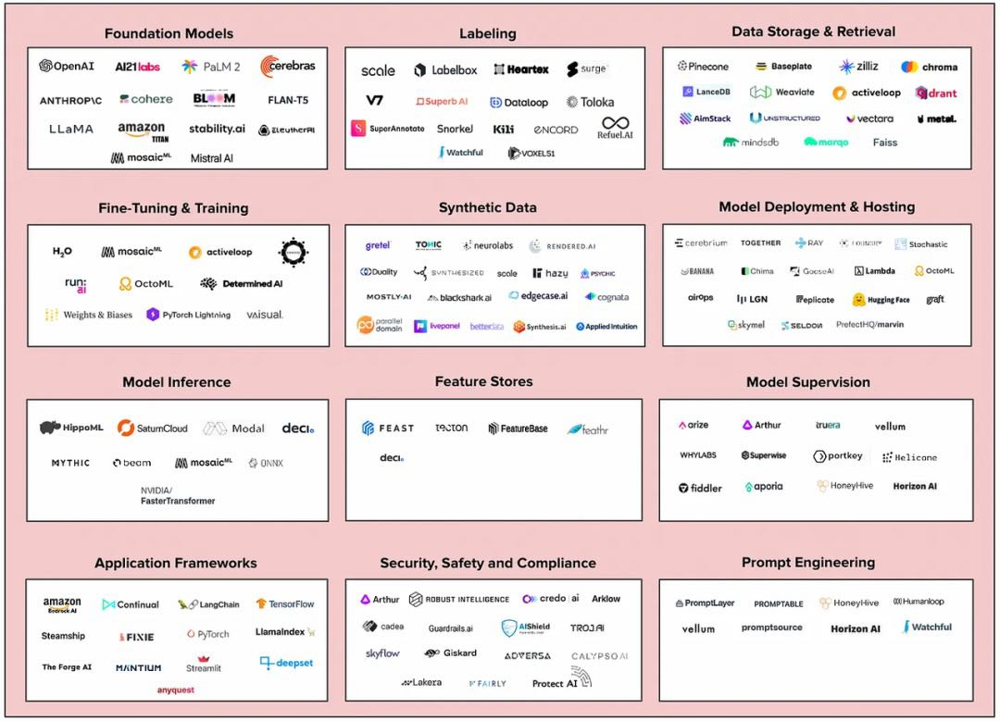

# AI 概览
> 成为出题家。而不是做题家。我们来出题，AI 来做题。

## 内容
* AI 模型
  * LLM(语言大模型)
  * 图像模型
  * 语言，视频等多模态模型
  * 具体场景的模型：推理等
* 技术
* 应用场景
* 开发应用

## 整体的生态
  
图片来源：[《The New Generative AI Infra Stack》](https://medium.com/cowboy-ventures/the-new-infra-stack-for-generative-ai-9db8f294dc3f)
> 1. 模型：开源 vs 闭源
> 2. 部署
> 3. 合成数据
> 4. 微调与数据标注
> 5. 数据存储与检索
> 6. 模型监督
> 7. 模型的安全性、安全防护和合规性
> 8. 应用框架

* 底层： AI 模型
* 模型的训练
* 中间层：
    * 编排：LangChain， LamaIndex，
    * 嵌入：向量数据库
    * 缓存：GTP chache，Redis
    * LLMOps: Weights & Biases, MLflow
    * Validation
    * 应用部署： Vercel，Steamship
* 应用层。不同类型的应用

## 资源
* [Prompt Engineer Guide](https://www.promptingguide.ai/zh)
* [万字科普ChatGPT-4为何会颠覆人类社会](https://www.modevol.com/episode/clf9d5kni0zo301mm6tkl9t87)
* [ChatGPT学习笔记](https://wqw547243068.github.io/chatgpt)
* [AIGC 工具群](https://bytedance.feishu.cn/base/AIMAbnJxQaNgSGsBAtwcdAkLnvf?table=tblmZTd8VuUOOONh&view=vew0Eo17BB)
* [GPT best practices](https://platform.openai.com/docs/guides/gpt-best-practices)。 Openai 官方出品。This guide shares strategies and tactics for getting better results from GPTs. 
* [AIGC周刊](https://op7418.zhubai.love/) 归藏。
* [Awesome AI Agents](https://github.com/e2b-dev/awesome-ai-agents)
