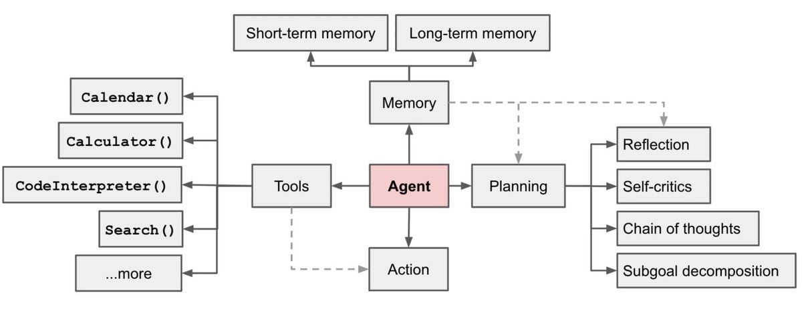

# 代理(Agent) 

> -- [《LLM Powered Autonomous Agents》](https://lilianweng.github.io/posts/2023-06-23-agent/)

> Agents use an LLM to determine which actions to take and in what order. An action can either be using a tool and observing its output, or returning a response to the user.  
> 代理使用LLM来确定要采取哪些操作以及以何种顺序进行。操作可以是使用工具并观察其输出，也可以是向用户返回响应。  
> -- [LangChain agents](https://python.langchain.com/docs/modules/agents/)

## Agent 类型
### Action agents
根据之前所有的动作来决定下一个动作。也就是见机行事。

### Plan-and-execute agents
规划和执行。预先规划行动的全部顺序，然后在不更新计划的情况下全部执行。

> Subgoal and decomposition: The agent breaks down large tasks into smaller, manageable subgoals, enabling efficient handling of complex tasks.  
> 子目标和分解：代理将大型任务分解为更小的、可管理的子目标，从而能够高效地处理复杂的任务。  
> Reflection and refinement: The agent can do self-criticism and self-reflection over past actions, learn from mistakes and refine them for future steps, thereby improving the quality of final results.  
> 反思与提炼：代理人可以对过去的行为进行自我批评和自我反思，从错误中吸取教训，并为未来的步骤改进它们，从而提高最终结果的质量。  

## 任务分解
### [Chain of thought(CoT, 思考链)](https://arxiv.org/abs/2201.11903)
该模型被指示“一步一步地思考”，以利用更多的时间计算将难的任务分解成更小更简单的步骤。触发 COT 的提示词如：
1. Steps for XYZ；What are the subgoals for achieving XYZ
2. Write a story outline


### [Tree of Thoughts(思考树)](https://arxiv.org/abs/2305.10601)
通过在每个步骤探索多种可能性来扩展CoT。它首先将问题分解为多个步骤，并在每一步生成多个思考，从而创建一个树结构。搜索过程可以是BFS（广度优先搜索）或DFS（深度优先搜索），其中每个状态由分类器（经由提示）或多数投票来评估。


## Self-Reflection 自我反省
> 自我反思是一个至关重要的方面，它允许代理通过改进过去的行动决策和纠正以前的错误来迭代改进。它在现实世界的任务中发挥着至关重要的作用，在那里试错是不可避免的。

### ReAct 框架
> ReAct(Reason + Act): integrates reasoning and acting within LLM by extending the action space to be a combination of task-specific discrete actions and the language space. The former enables LLM to interact with the environment (e.g. use Wikipedia search API), while the latter prompting LLM to generate reasoning traces in natural language.
> -- [ReAct](https://arxiv.org/abs/2210.03629)

ReAct 的提示词：
```
Thought: ...
Action: ...
Observation: ...
... (Repeated many times)
```

针对知识密集型和决策任务会有不同处理。在决策任务中， Thought 步骤会被移除。

### Reflexion 框架
> Reflexion 为智能体配备动态记忆和自我反思能力，以提高推理技能。Reflexion具有标准RL设置，其中奖励模型提供简单的二进制奖励，动作空间遵循ReAct中的设置，其中任务特定的动作空间用语言增强以实现复杂的推理步骤。在每个动作之后 ，代理计算启发式 ，并且可选地可以根据自我反思结果决定重置环境以开始新的试验。
> -- [Reflexion](https://arxiv.org/abs/2303.11366)

### Chain of Hindsight
> 鼓励模型通过显式地呈现一系列过去的输出来改进其自身的输出，每个输出都带有反馈注释。

## 用 Agent 做的产品

Auto GPT
GPT Engineer
BabyAGI

### Hugging GPT
使用 ChatGPT作为任务规划器，根据模型描述选择 HuggingFace 平台中可用的模型，并根据执行结果总结响应。

## 文章
* [《LLM Powered Autonomous Agents》](https://lilianweng.github.io/posts/2023-06-23-agent/)
* [Awesome AI Agents](https://github.com/e2b-dev/awesome-ai-agents)
* [Generative Agents: Interactive Simulacra of Human Behavior](https://arxiv.org/abs/2304.03442)